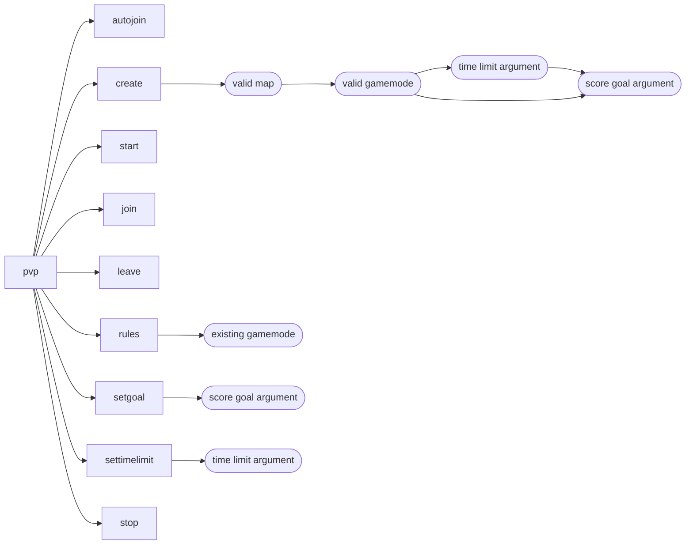
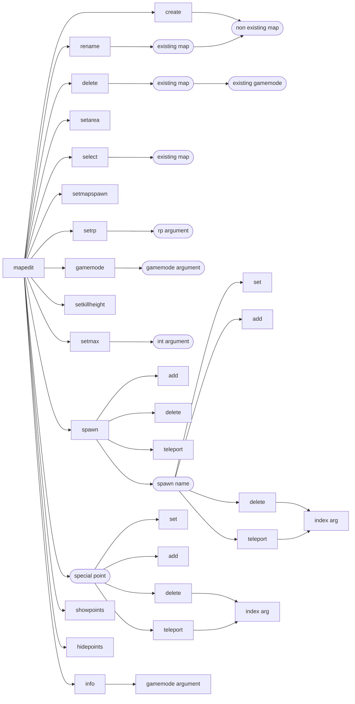

```mermaid
graph LR;
    
pvp --> autojoin
pvp --> create
create --> valid_map([valid map])
valid_map --> valid_gamemode([valid gamemode])
valid_gamemode --> time_limit([time limit argument])
time_limit --> score_goal([score goal argument])
valid_gamemode --> score_goal
pvp --> start
pvp --> join
pvp --> leave
pvp --> rules
rules --> existing_gamemode([existing gamemode])
pvp --> setgoal --> score_goal_arg([score goal argument])
pvp --> settimelimit --> time_limit_arg([time limit argument])
pvp --> stop
```

```mermaid
graph LR;

mapedit --> create --> non_existing_map([non existing map])
mapedit --> delete --> existing_map([existing map]) --> existing_gamemode([existing gamemode])
mapedit --> rename --> existing_map2([existing map]) --> non_existing_map
mapedit --> select --> existing_map3([existing map])
mapedit --> setarea
mapedit --> setrp --> rp_argument([rp argument])
mapedit --> setmapspawn
mapedit --> gamemode --> gamemode_argument([gamemode argument])
mapedit --> setmax --> int_arg([int argument])
mapedit --> setkillheight
mapedit --> spawn 
spawn --> add
spawn --> delete1[delete]
spawn --> teleport
spawn --> spawn_name([spawn name])
spawn_name --> set
spawn_name --> add1[add]
spawn_name --> delete2[delete] --> index_arg[index arg]
spawn_name --> teleport1[teleport] --> index_arg
mapedit --> special_point([special point])
special_point --> set1[set]
special_point --> add2[add]
special_point --> delete3[delete] --> index_arg1[index arg]
special_point --> teleport2[teleport] --> index_arg1
mapedit --> info --> gamemode_argument1[gamemode argument]
mapedit --> showpoints
mapedit --> hidepoints
```