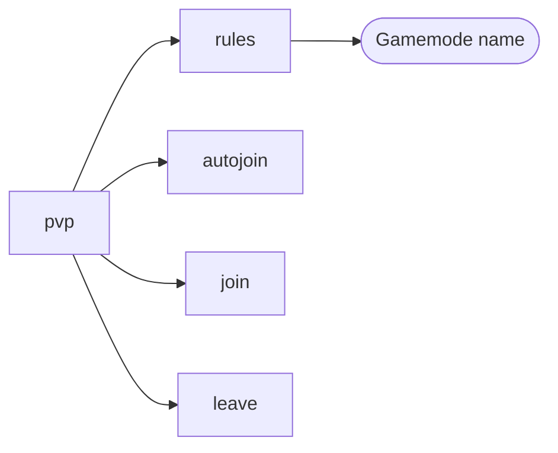
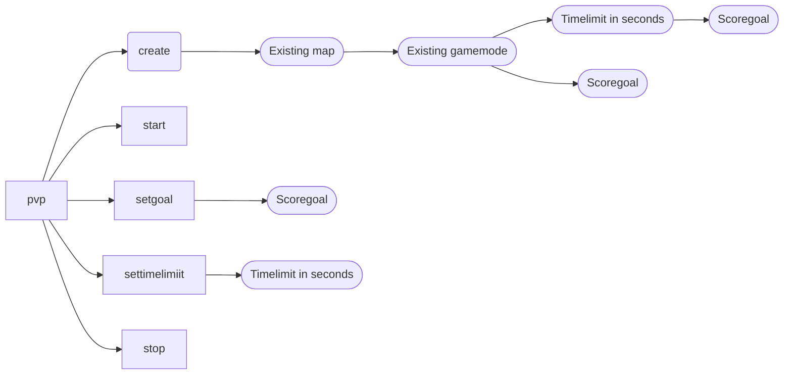
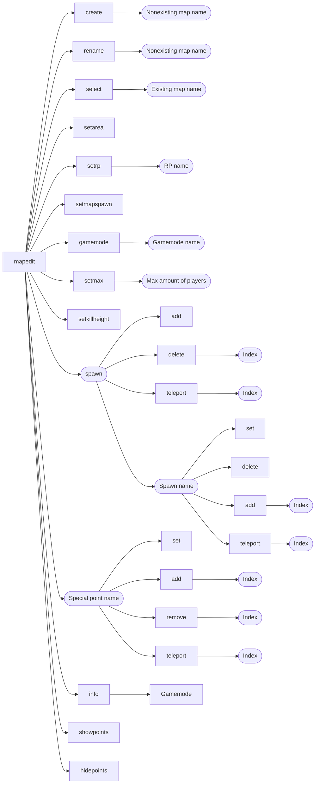
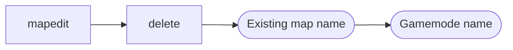

# PVP Server Manual

1. [Commands](#1-commands)
   1. [Permissions in the plugin](#1i-permissions-in-the-plugin)
      1. [Role collections](#1ia-role-collections)
      2. [No permissions](#1ib-no-permissions)
      3. [canRun](#1ic-canrun)
      4. [pvp.mapEditor](#1id-mapeditor)
      5. [adminPermission](#1ie-adminpermission) 
   2. [Based on roles on the server](#1ii-based-on-roles-on-the-server)
      1. [Every player](#1iia-every-player)
      2. [Guide](#1iib-guide)
      3. [Valar](#1iic-valar)
2. [Maps](#2-maps)

## 1. Commands

### 1.i Permissions in the plugin

#### 1.i.a Role Collections

There are two roles in the PVP server, PVP Manager and PVP Admin. PVP Manager has the permission canRun, whilst PVP
Admin has all permissions in the plugin.

#### 1.i.b No permissions

The commands that players without any permissions can do:

#### 1.i.c canRun

The commands that players with this permission can do in addition to [No permissions](#1ib-no-permissions):

#### 1.i.d mapEditor

The commands that players with this permission can do in addition to [No permissions](#1ib-no-permissions):

#### 1.i.e adminPermission

The commands that players with this permission can include all of the above and are extended by:

### 1.ii Based on roles on the server
#### 1.ii.a Every player
The commands that every player can use are detailed in [No permissions](#1ib-no-permissions).
#### 1.ii.b Guide
The commands that guides can use are [No permissions](#1ib-no-permissions) and [canRun](#1ic-canrun)
#### 1.ii.c Valar
Valar can use all commands within the pvp plugin.
## 2. Maps